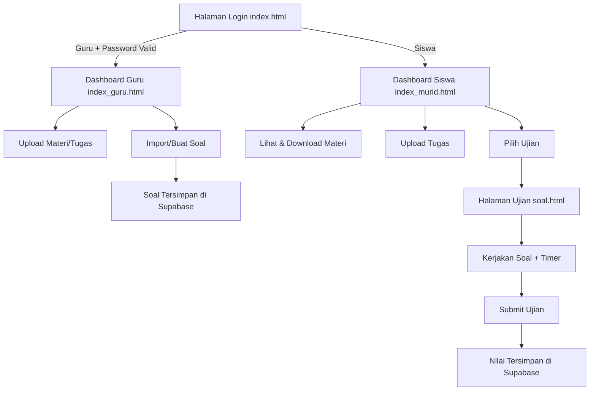

# SMK-e-Learning-Exam-Management-System-
# 📚 SMK Veteran 1 Sukoharjo – Manajemen Materi, Tugas & Ujian

Aplikasi berbasis web untuk **manajemen materi, tugas, dan ujian** antara guru dan siswa di SMK Veteran 1 Sukoharjo.  
Dilengkapi dengan fitur **upload file**, **manajemen folder**, **import soal ujian**, serta **sistem ujian online** yang terintegrasi dengan **Supabase**.

---

## 🚀 Fitur Utama

### 👩‍🏫 Mode Guru (`index_guru.html`)
- **Manajemen Materi & Tugas**
  - Upload file (PDF, DOCX, PPTX, ZIP – max 50MB)
  - Membuat folder baru
  - Menyusun file secara hierarki
- **Manajemen Soal**
  - Membuat ujian baru
  - Import soal dari **Excel/CSV** dengan **pemetaan kolom**
  - Pratinjau soal sebelum import
- **Manajemen Nilai**
  - Melihat hasil ujian siswa
  - Ekspor nilai
- **Autentikasi Guru**
  - Akses hanya dengan password yang tersimpan di Supabase

### 👨‍🎓 Mode Siswa (`index_murid.html`)
- **Pengumpulan Tugas**
  - Upload tugas (max 10MB)
  - Download materi dari guru
- **Akses Materi**
  - Lihat dan pelajari materi pembelajaran
  - Status materi: `Selesai`, `Dalam Proses`, `Belum Dimulai`
- **Ujian Online**
  - Menampilkan soal sesuai ujian yang tersedia
  - Timer otomatis
  - Larangan copy teks soal + peringatan
  - Navigasi antar soal & submit ujian

### 📝 Halaman Ujian (`soal.html`)
- Menampilkan soal ujian
- Navigasi soal
- Konfirmasi sebelum submit
- Notifikasi ujian selesai

---

## 📂 Struktur Proyek

```
.
├── index.html              # Halaman utama – pilih mode siswa/guru
├── index_guru.html         # Dashboard guru
├── index_murid.html        # Dashboard siswa
├── soal.html               # Halaman ujian siswa
│
├── css/
│   └── styles.css          # Styling utama aplikasi
│
├── gambar/                 # Icon, logo, dan aset gambar
│
├── jees/
│   ├── app_guru.js         # Logika file manager & manajemen ujian guru
│   ├── app_murid.js        # Logika file manager siswa
│   ├── config.js           # Konfigurasi Supabase
│   ├── exam_student.js     # Logika ujian siswa
│   ├── script.js           # Login, theme toggle, autentikasi guru
│
└── README.md               # Dokumentasi proyek
```

---

## 🛠 Teknologi yang Digunakan
- **Frontend:** HTML5, CSS3, JavaScript (ES6)
- **UI/UX:** Font Awesome, Google Fonts (Poppins)
- **Backend & Storage:** [Supabase](https://supabase.com/)
- **File Parsing:** [xlsx.js](https://github.com/SheetJS/sheetjs) untuk import soal Excel
- **Preview Link:** [link-preview-js](https://www.npmjs.com/package/link-preview-js)

---

## ⚙️ Instalasi & Konfigurasi

1. **Clone repository**
   ```bash
   git clone https://github.com/username/project-name.git
   cd project-name
   ```

2. **Konfigurasi Supabase**
   - Buka `jees/config.js`
   - Ganti `supabaseUrl` dan `supabaseKey` dengan milik Anda:
     ```javascript
     const supabaseUrl = 'https://YOUR_PROJECT.supabase.co';
     const supabaseKey = 'YOUR_PUBLIC_ANON_KEY';
     ```

3. **Struktur Database Supabase**
   Buat tabel berikut di Supabase:
   - `files` – metadata file/folder
   - `exams` – daftar ujian
   - `questions` – soal ujian
   - `teacher_passwords` – autentikasi guru

4. **Jalankan secara lokal**
   - Gunakan Live Server (VSCode) atau server lokal:
     ```bash
     npx serve .
     ```

---

## 🔐 Login Guru
- Buka `index.html` → klik **Masuk sebagai Guru**
- Masukkan password yang telah disimpan di tabel `teacher_passwords` Supabase

---

## 🔄 Diagram Alur Aplikasi



---

## 📸 Screenshot
> _(Tambahkan screenshot tampilan dashboard guru, siswa, dan halaman ujian di sini)_

---

## 🧑‍💻 Kontributor
- **Dani @Teknik Comp** – Pengembang & Desain Sistem

---

## 📜 Lisensi
Proyek ini dilisensikan di bawah **MIT License**.
